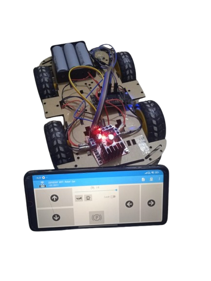
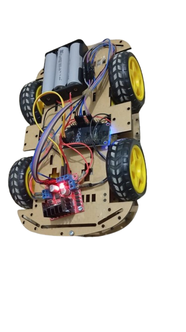

# CodingMoves-RC+
## 🚗 WiFi-Controlled RC Car using NodeMCU (ESP8266)

A fun IoT project where you control an RC car over WiFi using your mobile phone. This project uses a NodeMCU (ESP8266) board, L298N motor driver, and a basic HTML interface.

---


**Course:** Digital Logic Design (DLD)
**Semester:** 2rd  
**Submitted To:** Engr. Romaisa Shamshad Khan
**Submitted By:**  
-  *Moavia Amir* (2k24_BSAI_72)  
-  *Muhammad Dawood* (2k24_BSAI_48) 
-  *Fatima Hassan* (2k24_BSAI_07)
-  *JAVERIA BABAR* (2K24_BSAI_14)

---
## 📸 Final Project Snapshot





---

## 📂 Project Folder Structure

Below is the folder structure for the WiFi-Controlled RC Car project:

```markdown
iot-rc-car-controller/
│
├── code/
│ └── rc_car_controller.ino # ESP8266 code in C++
│
├── interface/
│ └── index.html # Controller code
│
├── images/
│ └── demo.jpg # Image of the final car setup
│
├── docs/
│ └── circuit_diagram.png # Circuit diagram for wiring
| └── Proposal.pdf
| └── Report.pdf
│ 
└── README.md # This documentation file
```

---

## 🌐 Social Media Accounts

Follow **Coding Moves** on all platforms for more fun projects:

- 🧠 YouTube: [@Coding_Moves](https://www.youtube.com/@Coding_Moves)
- 👨‍💻 GitHub: [Muawiya-contact](https://github.com/Muawiya-contact)
- 💼 LinkedIn: [Moavia Amir](https://linkedin.com/in/contactmuawia)
- 📊 Kaggle: [Moavia Amir](https://www.kaggle.com/moaviaamir)

---

## 🔧 Components

***All components*** 

- **ESP8266 Module (NodeMCU)**  
  
 
  _Purpose:_ The heart of the project, the NodeMCU module provides WiFi connectivity, enabling the control of the RC car via commands sent from the web interface.

- **L298N Motor Driver**  
  

  _Purpose:_ The L298N motor driver controls the speed and direction of the DC motors, allowing for precise movement of the RC car. It serves as the interface between the NodeMCU and the motors.

- **DC Motors (4x)**  
   
  
  _Purpose:_ These four motors provide the necessary movement for the RC car, enabling it to move forward, backward, left, and right.

- **Wheels (4x)**  
  

  _Purpose:_ These wheels, mounted on the DC motors, allow the RC car to drive across various surfaces.

- **Chassis**  
  

  _Purpose:_ The chassis is the structural frame that holds all the components of the car, including the motors, wheels, and the NodeMCU.

- **Battery Pack (7.4V)**  
   

  _Purpose:_ This battery pack powers the RC car and its components, providing the necessary voltage for the motors and electronics to function.

- **Jumper Wires**  
   

  _Purpose:_ Jumper wires are used for making the necessary electrical connections between the NodeMCU, motor driver, and other components.

- **Smartphone**  
  

  _Purpose:_ A smartphone is used to interact with the web interface for controlling the RC car via the NodeMCU's WiFi network.

---

## 🛠️ Tools & Technologies

- **NodeMCU ESP8266**  
- **L298N Motor Driver**  
- **DC Motors**  
- **HTML + JavaScript (for UI)**  
- **Arduino IDE**  

---

## 📌 How to Use

1. Upload the `.ino` file to your NodeMCU.  
2. Connect to the WiFi AP `NodeMCU Car`.  
3. Open the web interface in your mobile browser.  
4. Use directional buttons to control your car.  

---

## 🤝 Credits

By **Coding Moves**  
Passionately building cool projects that move!

---
