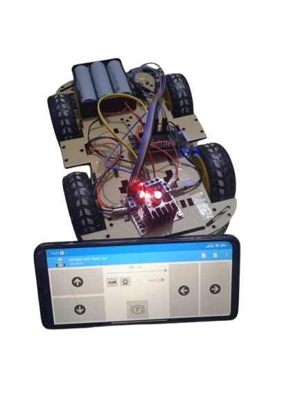
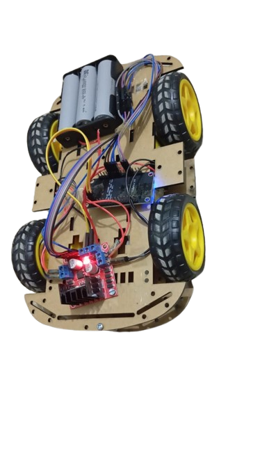

# CodingMoves-RC+

A WiFi-controlled RC car built on a NodeMCU (ESP8266). The board runs as a
WiFi access point and serves HTTP commands; a small HTML/JavaScript page on
your phone sends direction and speed commands, and an L298N driver moves the
four DC motors.

**Course:** Digital Logic Design (DLD), 2nd semester
**Submitted to:** Engr. Romaisa Shamshad Khan
**Team:** Moavia Amir (2k24_BSAI_72), Muhammad Dawood (2k24_BSAI_48),
Fatima Hassan (2k24_BSAI_07), Javeria Babar (2k24_BSAI_14)

## Parts

- NodeMCU ESP8266
- L298N motor driver
- 4x DC motors with wheels
- Chassis
- 7.4V battery pack
- Jumper wires
- A smartphone (or any browser) for control

## Wiring

Pin mapping used in `code/rc_car_controller.ino`:

| L298N pin | GPIO | NodeMCU pin | Role |
|-----------|------|-------------|------|
| ENA | 14 | D5 | Right motor speed (PWM) |
| ENB | 12 | D6 | Left motor speed (PWM) |
| IN1 | 15 | D8 | Right motor direction |
| IN2 | 13 | D7 | Right motor direction |
| IN3 | 2  | D4 | Left motor direction |
| IN4 | 0  | D3 | Left motor direction |

A circuit diagram, proposal, and report are in `docs/`.

## Flash and run

1. Open `code/rc_car_controller.ino` in the Arduino IDE (with ESP8266 board
   support installed) and upload it to the NodeMCU.
2. Power the car. The board creates an access point named
   `Coding Moves RC+` with password `codingmoves_123`.
3. Connect your phone to that network and open
   `interface/index.html` in the browser. It sends requests to the board at
   `192.168.4.1` as `http://192.168.4.1/?State=<cmd>`.
4. Hold the arrow buttons to drive (forward, back, left, right); releasing
   sends stop. The lightning buttons set speed levels (0-9 map to PWM values
   400-1023 in the sketch).

## Repository layout

- `code/rc_car_controller.ino` — ESP8266 firmware
- `interface/index.html` — control page
- `docs/` — circuit diagram, proposal, report
- `images/` — photos of the build

## Credits

A Coding Moves project. More at
[YouTube](https://www.youtube.com/@Coding_Moves),
[GitHub](https://github.com/Muawiya-contact),
[LinkedIn](https://linkedin.com/in/contactmuawia),
[Kaggle](https://www.kaggle.com/moaviaamir).
